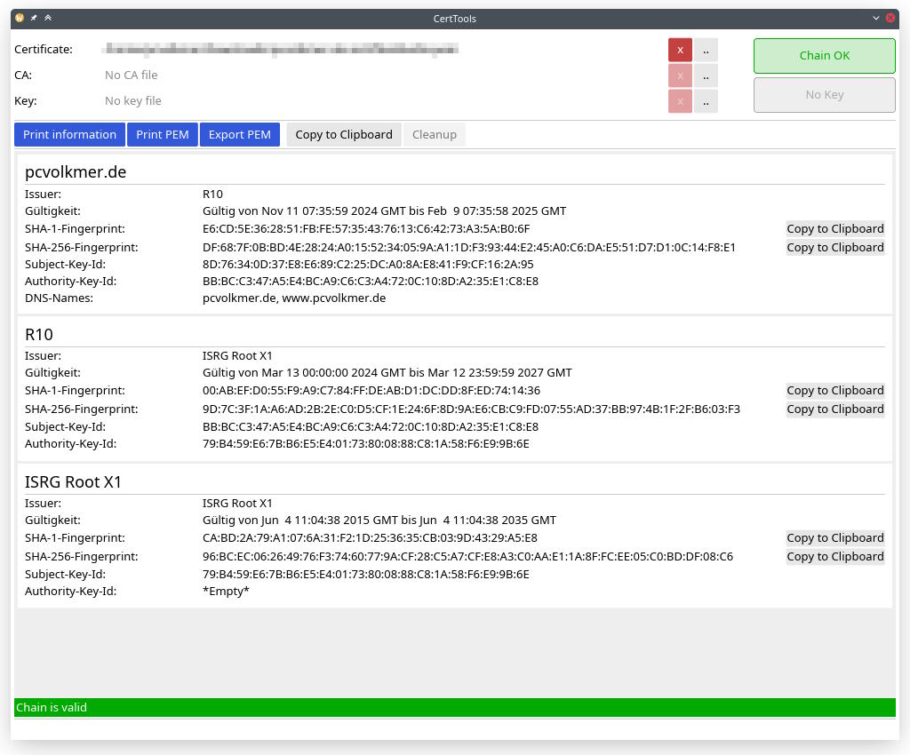

# Cert-Tools

Application to show and merge content of PEM files

## Usage

This application provides two tools: `print` and `merge`.

### Print content of PEM files

This will print out some information about the file(s), checks if the certificate chain is valid and each certificate is
within its lifetime.

If the argument `KEY` is present, the contained private key will be checked against the first certificates
public key.

If the given certificate file only contains the certificate, but not the complete certificate chain, the optional
argument `--ca` can be used to print the whole chain.

```
Usage: cert-tools print [OPTIONS] <CERT> [KEY]

Arguments:
  <CERT>  Datei mit Zertifikaten im PEM-Format
  [KEY]   Datei mit Private Key im PEM-Format (Optional)

Options:
      --ca <CA>  Datei mit CA im PEM-Format (Optional)
  -h, --help     Print help

```


### Merge Cert and CA file

This will print out a merged certificate chain.

If the resulting PEM file contains certificates not in required order, the certificates will be sorted.
In case of certificates present in both files, the application ensures that each certificate only appears once.

If the argument `CA` is missing, only the given certificate file will be processed (sorting, unique certificates).

```
Usage: cert-tools merge <CERT> [CA]

Arguments:
  <CERT>  Datei mit Zertifikaten im PEM-Format
  [CA]    Datei mit CA im PEM-Format

Options:
  -h, --help  Print help
```

**Example**

```shell
cert-tools merge cert.pem ca.pem > chain.pem
```

## GUI

In addition to the console-based application, a simple [iced](https://github.com/iced-rs/iced)-based graphical user
interface is available in (sub-)package `ui`.



The GUI also provides export to a password protected PKCS #12 file, including certificates and private keys.